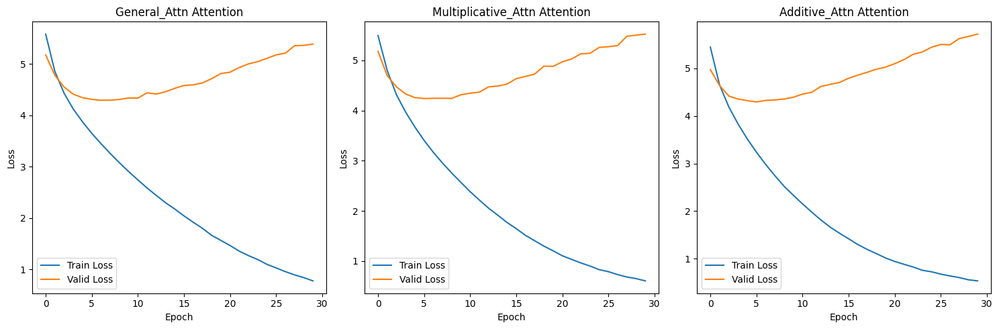
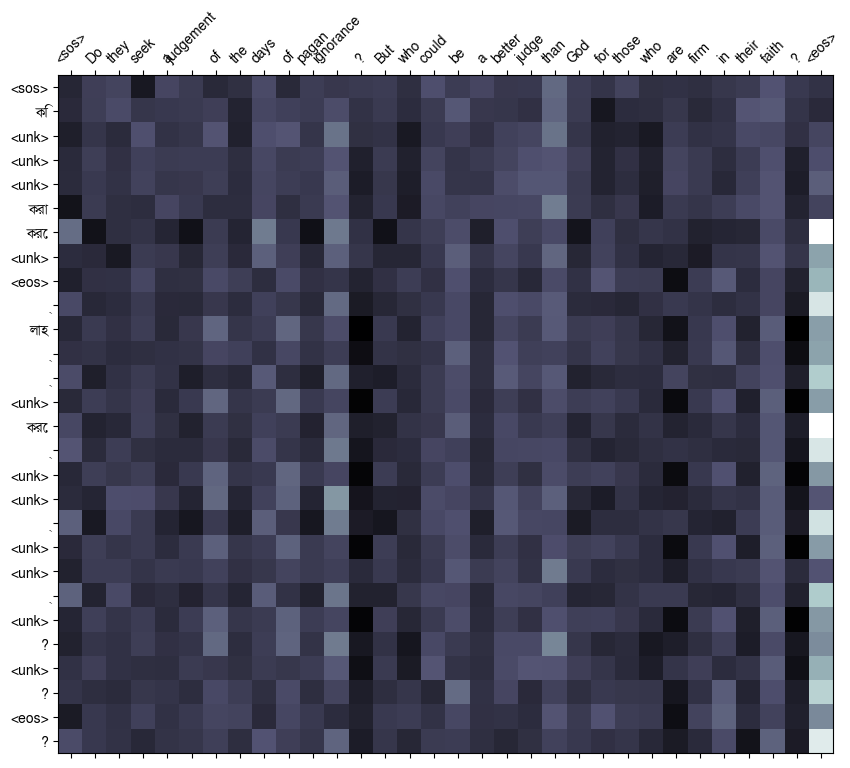
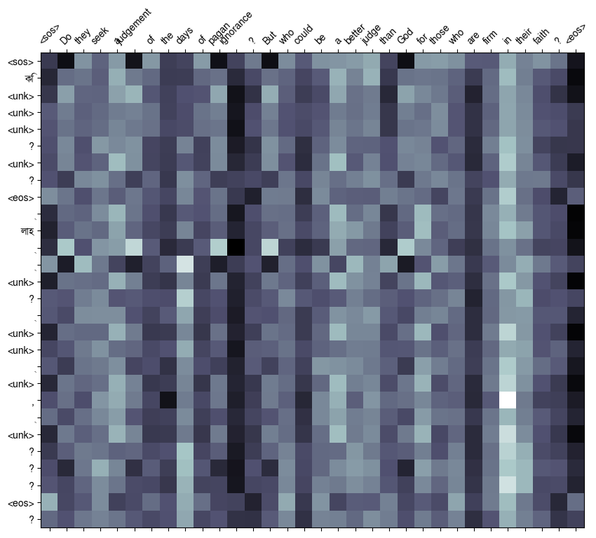
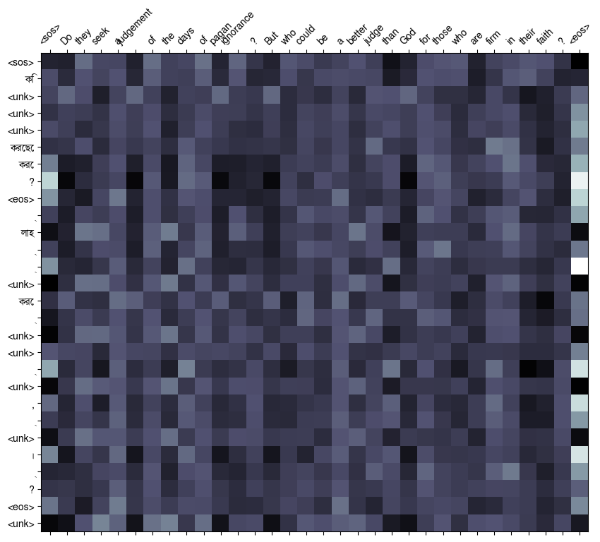
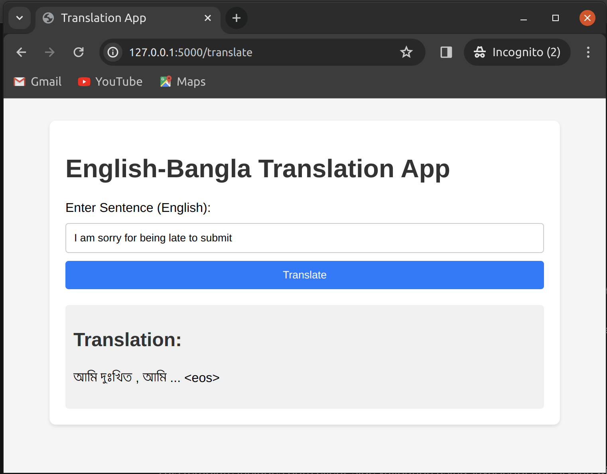

# A3: Machine Translation

## Table of Contents
1. [Overview](#overview)
2. [Task 1. Get Language Pair](#task-1-get-language-pair)
   - [1.1 Foundational Research Papers](#11-foundational-research-papers)
   - [1.2 Data Description](#12-data-description)
   - [1.3 Dataset Sampling and Preprocessing Overview](#13-dataset-sampling-and-preprocessing-overview)
3. [Task 2. Experiment with Attention Mechanisms](#task-2-experiment-with-attention-mechanisms)
   - [Training Process](#training-process)
4. [Task 3. Evaluation and Verification](#task-3-evaluation-and-verification)
   - [Dataset Statistics](#dataset-statistics)
   - [Model Evaluation Criteria](#model-evaluation-criteria)
   - [Model Comparison](#model-comparison)
   - [Analysis and Discussion](#analysis-and-discussion)
   - [Future Performance Improvement Strategies](#future-performance-improvement-strategies)
5. [Task 4. Machine Translation - Web Application Development](#task-4-machine-translation---web-application-development)
   - [Web Application Features](#web-application-features)
   - [Getting Started with the Web Application](#getting-started-with-the-web-application)
   - [Application Architecture](#application-architecture)
6. [Contributing & Support](#contributing--support)
7. [License](#license)
8. [Acknowledgments](#acknowledgments)


## Overview
In this project, we delved into the domain of neural machine translation, with a specific focus on translating between English and Bangla languages. Our objective was to explore various attention mechanisms within the Transformer architecture to enhance translation quality and efficiency.

## Task 1. Get Language Pair
This task involves setting up the project, preparing the data, and training the LSTM language model.

### 1.1 Foundational Research Papers
Our project is inspired by the seminal paper ["Attention is All You Need"](https://arxiv.org/abs/1706.03762), which introduced the Transformer architecture. Here's a concise summary:
  
- **Concept**: Transformer replaces recurrent layers with self-attention mechanisms for capturing global dependencies in sequences.
- **Key Features**: 
  - Self-Attention: Enables capturing long-range dependencies efficiently.
  - Positional Encoding: Incorporates token order information without recurrent connections.
  - Encoder-Decoder Architecture: Consists of encoder and decoder layers for input processing and output generation.
- **Advantages**: 
  - Parallelization: Allows for efficient parallel processing of sequences.
  - Long-Range Dependencies: Better handling of long-range dependencies compared to recurrent architectures.
  - Scalability: Highly scalable and effective on large datasets with minimal modifications.
- **Impact**: 
  - Transformed NLP: Became the standard architecture for various NLP tasks, including machine translation.
  - Legacy: Paved the way for subsequent advancements in NLP research and applications.

Our project builds upon these foundational concepts to explore English-to-Bangla machine translation.


### 1.2 Data Description

This dataset specification outlines the use of a machine translation dataset from the Hugging Face datasets library.

#### Language Selection
- **Source Language (`SRC_LANGUAGE`)**: English (`en`) - the language we translate from.
- **Target Language (`TRG_LANGUAGE`)**: Bengali (`bn`) - the language we translate into.

#### Dataset Selection
- **Dataset Used**: OPUS-100 Corpus, focusing on the "bn-en" language pair, available on Hugging Face's dataset repository.
    - Chosen for its high-quality, parallel sentences, essential for effective machine translation model training.

For more information and to access the dataset, visit the [Hugging Face Datasets Library](https://huggingface.co/datasets/opus100).

---


### 1.3 Dataset Sampling and Preprocessing Overview

- Initialize a random number generator with a fixed seed for reproducibility.

- Randomly select 3000 examples from the `train` split for a balanced approach to computational efficiency and dataset diversity.

    - Splits: Train (2100 samples), Validation (450 samples), Test (450 samples)

#### Tokenizing with spaCy Models

- Use spaCy to set up tokenizers for both source and target languages, enhancing preprocessing with its advanced tokenization capabilities.

- **Setup Details**:

    - The target language (Bangla) tokenizer uses `'xx_ent_wiki_sm'` for effective across various languages, including Bangla.
    - The source language (English) tokenizer relies on `'en_core_web_sm'`, optimized for web text with efficient tokenization and tagging.

To download spaCy models, use the following commands in our terminal:

```bash
# For the multi-language entity recognition model
python -m spacy download xx_ent_wiki_sm

# For the small English model optimized for web content
python -m spacy download en_core_web_sm
```


## Task 2. Experiment with Attention Mechanisms

This section provides an overview of the key components within the Transformer model architecture, highlighting the Encoder, Decoder, and their supporting layers. The Transformer model is renowned for its effectiveness in handling sequence-to-sequence tasks, such as machine translation.

**EncoderLayer Class**
- A single layer in the Transformer model encoder, crucial for transforming input sequences into higher-level representations.
- **Key Components** include the Self-Attention Mechanism, Positionwise Feedforward Network, and Normalization and Dropout, each contributing to the model's ability to capture context and dependencies within the input.

**Encoder Class**
- Serves as the core of the Transformer's encoder, converting input sequences into rich representations that encapsulate semantic and contextual relationships.
- Incorporates Token and Positional Embedding, multiple Encoder Layers, and Dropout, sequentially refining the input representation.

**AttentionLayer Class**
- Facilitates selective focus on different parts of the input sequence, employing General, Multiplicative, and Additive attention mechanisms.
- **Key Features**:
  - **Configurability**: Supports various attention types, enabling flexibility to tackle diverse data modeling challenges.
  - **Equations for Attention Mechanisms**:

    1. **General Attention**: 
    
    $$e_i = \mathbf{s}^\text{T}\mathbf{h}_i \in \mathbb{R} \quad \text{where} \quad d_1 = d_2$$


    2. **Multiplicative Attention**:
    $$e_i = \mathbf{s}^\text{T}\mathbf{W}\mathbf{h}_i \in \mathbb{R} \quad \text{where} \quad \mathbf{W} \in \mathbb{R}^{d_2 \times d_1}$$


    3. **Additive Attention**: 
   $$e_i = \mathbf{v}^\text{T} \tanh(\mathbf{W}_1\mathbf{h}_i + \mathbf{W}_2\mathbf{s}) \in \mathbb{R}$$


  - These equations delineate how each attention type calculates the energy score \(e_i\), which is pivotal for determining the focus areas of the model's input sequence.

**PositionwiseFeedforwardLayer**
- Processes inputs at each sequence position independently, crucial for learning complex patterns and adding depth to the Transformer's encoding capabilities.

**DecoderLayer**
- A key component of the Transformer's decoder, designed to generate the output sequence informed by the context of the encoded source sequence and the target sequence itself.
- Utilizes Self-Attention, Encoder-Decoder Attention, and Positionwise Feedforward Networks to refine the target sequence representation.

**Decoder Class**
- Central to the decoding process, this class generates the output sequence from the encoded source sequence, applying Token and Positional Embeddings, Decoder Layers, and an Output Linear Layer to produce next-token predictions.

**Seq2SeqTransformer Class**
- Integrates the Encoder and Decoder to form a complete sequence-to-sequence model, suited for various NLP tasks.
- Employs Source and Target Masks to manage attention focus and ensure the integrity of sequence processing.

The Transformer model architecture leverages these components to efficiently process and generate sequences, achieving state-of-the-art performance on numerous NLP tasks. Its parallelizable training and adaptability across different applications make it a cornerstone of modern natural language processing.


### Training Process
#### Transformer Model Configuration for Translation

This section outlines the configuration specifics of a Transformer model tailored for sequence-to-sequence translation tasks. The model's architecture, comprising an encoder and decoder, is designed to adeptly handle the intricacies of language translation.

**Model Parameters**
- **Input/Output Dimensions**: Correlate with the source and target vocabulary sizes, setting the framework for the model's language processing capabilities.
- **Hidden Dimension (`hid_dim`)**: Specifies the size of internal vectors, which is central to the model's ability to represent and process language data.
- **Number of Layers**: The depth of both encoder and decoder, critical for the model's proficiency in parsing and generating sequences.
- **Number of Attention Heads**: Enables the model to concurrently focus on various segments of the sequence, enhancing its contextual understanding.
- **Feedforward Dimension**: Defines the size of the hidden layer within position-wise feedforward networks, impacting the transformation and processing of data.
- **Dropout Rate**: A regularization technique that randomly omits a subset of units during training to prevent overfitting.

**Hyperparameters**
- **Batch Size**: Determines the number of sequences processed in unison, influencing both learning efficiency and computational demands.
- **Learning Rate**: Regulates the optimization step size, essential for effective model training and convergence.
- **Epochs**: The total number of times the training dataset is iteratively passed through the model, indicative of the training duration.
- **Gradient Clipping**: Curbs the magnitude of gradients to avert the destabilizing effects of excessively large gradients, fostering stable training progress.

**Initialization**
- Utilizes Xavier uniform initialization for the model's weights to ensure a balanced start, promoting consistent and efficient training dynamics.

#### Training Function for Sequence-to-Sequence Models

The training function is pivotal in steering the model through the learning process, meticulously refining its parameters for improved prediction accuracy.

**Key Steps**
- **Forward Pass**: Conducts model inference on each source-target sequence pair, meticulously aligning inputs and outputs to facilitate effective learning.
- **Loss Computation**: Calculates the divergence between the model's predictions and the actual target sequences using a designated loss criterion.
- **Backward Pass and Optimization**: Computes gradients based on the loss and updates the model's parameters accordingly, with gradient clipping employed to temper gradient explosion risks.
- **Epoch Loss Tracking**: Aggregates loss metrics across batches to monitor training progress and inform potential adjustments.

**Purpose**
- The training function is instrumental in optimizing the model, methodically reducing the loss to narrow the gap between predicted and actual sequences. This is achieved by iteratively adjusting the weights, guiding the model towards enhanced translation accuracy.


### 1.4 Getting Started

To get started with the Transformer Machine Translation project, follow these steps to set up the environment, prepare the data, and initiate the training process:

1. **Environment Setup**:
    - Ensure Python 3.11.4+ installed.
    - Create a virtual environment to manage dependencies:
      ```bash
      python -m venv venv
      ```
    - Activate the virtual environment:
      - On Windows: `venv\Scripts\activate`
      - On macOS/Linux: `source venv/bin/activate`
    - Install the required dependencies:
      ```bash
      pip install -r requirements.txt
      ```


## Task 3. Evaluation and Verification
We experimented Evaluation with different attention mechanisms, including General, Multiplicative, and Additive Attention.


#### Dataset Statistics
- **Splits**: Train (2100 samples), Validation (450 samples), Test (450 samples)
- **Vocabulary Size**:
  - English (EN): 1625 words
  - Bangla (BN): 2023 words

#### Model Evaluation Criteria

The epoch with the lowest validation loss is selected for evaluation on the test dataset to ensure the best model performance is captured.

| Model Type            | Epoch with Lowest Validation Loss | Lowest Validation Loss |
|-----------------------|-----------------------------------|------------------------|
| General_Attn          | 7                                 | 4.29465                |
| Multiplicative_Attn   | 6                                 | 4.24075                |
| Additive_Attn         | 6                                 | 4.29108                |


#### Model Comparison

##### Translation Accuracy 


| Attention Type      | Avg. Train Loss | Avg. Train PPL | Avg. Valid Loss | Avg. Valid PPL | 
|---------------------|-----------------|----------------|-----------------|----------------|
| General_Attn        | 2.378           | 28.123         | **4.725**           | **120.592**        | 
| Multiplicative_Attn | 2.094           | 23.941         | 4.762           | 128.351        | 
| Additive_Attn       | **1.927**           | **21.132**         | 4.874           | 145.778        | 

##### Computational Efficiency

| Attention Type       | Avg. Epoch Time (seconds) |
|---------------------|---------------------------|
| General_Attn        | **106.333**                   |
| Multiplicative_Attn | 109.633                   |
| Additive_Attn       | 111.033                   |

##### Test Performance (Selected by Lowest Validation Loss)

| Attention Type      | Number of Test Data | Test Loss | Test PPL |
|---------------------|---------------------|-----------|----------|
| General_Attn        | 450                 | 4.215     | 67.662   |
| Multiplicative_Attn | 450                 | 4.171     | 64.807   |
| Additive_Attn       | 450                 | **4.156**     | **63.846**   |

##### Attention Maps on a Pair of Test Sample Source & Target Text-

[General Attention Maps]
[Multiplicative Attention Maps]
[Additive Attention Maps]
#### Analysis and Discussion

- **Translation Accuracy**: Despite higher validation loss and PPL, Additive Attention demonstrates the best performance on the test set (also by considering the PPL and attention visualization), indicating its effectiveness in generalizing from the training data.

- **Computational Efficiency**: General Attention shows the best computational efficiency with the shortest average epoch time, making it suitable for environments with computational constraints.

- **Overall Effectiveness**: While General Attention offers a good balance between efficiency and accuracy, Additive Attention emerges as potentially more effective for practical applications due to its superior generalization on unseen data.


Therefore, **Additive Attention** mechanism has been identified as the most effective for generalizing from training to unseen data in English to Bangla translation tasks. Despite a slightly higher computational cost, its superior performance on the test set makes it the preferred choice for **our Web Application** where translation quality and accuracy are critical.


### Future Performance Improvement Strategies

Improving model performance requires a multifaceted approach, focusing on data preparation, model architecture adjustments, and training procedures. Here are some strategies that could help enhance the translation models' performance:

##### 1. Data Augmentation
- **Cleansing the Dataset**: Remove sentences other than source and target languages from the dataset to ensure cleaner training data.
- **Paraphrasing**: Generate paraphrased versions of the training sentences to enrich the dataset without altering the underlying meaning.
- **Back-Translation**: Increase the dataset size by translating target language sentences back into the source language and adding them as new training pairs.

##### 2. Hyperparameter Tuning
- **Learning Rate Adjustment**: Experiment with different learning rates or use learning rate schedulers to find the optimal rate for model training.
- **Batch Size Variation**: Test different batch sizes to find a balance between model performance, training speed, and memory usage.

##### 3. Advanced Model Architectures
- **Layer Normalization**: Incorporate layer normalization within the attention mechanisms to stabilize the learning process.
- **Transformer Modifications**: Explore variations of the Transformer architecture, such as the Transformer-XL, for improved handling of long-range dependencies.

##### 4. Expanding the Training Data
- **Entire Dataset Usage**: After cleansing, utilize the entire dataset for training by enhancing computational capabilities.
- **Diverse Sources**: Incorporate text from a wider range of sources to improve the model's ability to handle different styles and domains.
- **Cross-Lingual Transfer Learning**: Leverage transfer learning from models trained on high-resource language pairs to enhance performance on the target low-resource language pair.

##### 7. Evaluation and Iteration
- **Early Stopping**: Implement early stopping to prevent overfitting by halting the training when validation performance begins to deteriorate.
- **Continuous Evaluation**: Regularly evaluate the model on a validation set and adjust strategies based on performance trends.


## Task 4. Machine Translation - Web Application Development
This task outlines the deployment of an **Additive Attention Transformer Model** as an interactive web application using Flask, aimed at demonstrating the model's English to Bangla translation capabilities in a user-friendly manner.

### Web Application Features

- The application enables **real-time text translation**, allowing users to input text in English and receive translations in Bangla instantly.

### Getting Started with the Web Application

1. **Set Up the Flask Environment**:
   - Navigate to the Flask application directory.
   - Install dependencies with `pip install -r requirements.txt`.

2. **Start the Flask Server**:
   - Initiate the Flask server by running:
     ```sh
     python app.py
     ```
   - Access the server typically at `http://127.0.0.1:5000`.
      

3. **Interact with the Application**:
   - Visit the web application.
   - Input your English text.
   - Click 'Translate' to receive the Bangla translation.

### Application Architecture

- **Flask Backend**: Manages request handling, model interaction, and serves the generated text.
- **Frontend Interface**: Provides a user-friendly UI built with HTML, CSS, and JavaScript.
- **Model Integration**: Ensures seamless integration of the trained Transformer Model for efficient translation based on user inputs.

Furthermore, a live demo is available on Huggingface Space for users to experience the model's capabilities without the need for local setup:

<!-- - [Live Demo on Huggingface Space](https://huggingface.co/spaces/shaficse/a2-text-gen) -->

This deployment strategy not only showcases the Additive Attention Transformer Model's translation efficiency but also enhances its accessibility, facilitating broader interaction and appreciation of advancements in machine translation.

## Contributing & Support
Contributions are welcome. For issues or questions, please open an issue in the repository.

## License
This project is licensed under the MIT License.

## Acknowledgments
This journey from dataset preparation to model training and deployment underscores the collaborative efforts and various resources that facilitated this exploration. Special thanks to:We extend our gratitude to:

- **OPUS-100 Corpus** for the dataset that underpins our translation task.
- **spaCy** for providing essential NLP tools for data preprocessing.
- **"Attention Is All You Need" by Vaswani et al.**, the foundational paper that introduced the Transformer model, available at [arXiv:1706.03762](https://arxiv.org/abs/1706.03762).
- **"A Survey on Attention Mechanisms in NLP Problems"**, which provides an extensive overview of attention mechanisms and their applications, available at [arXiv:1904.02874](https://arxiv.org/pdf/1904.02874.pdf).

- **Flask framework** for enabling the deployment of interactive web applications.

- **Resource Contributions**: Special appreciation to [Chaklam Silpasuwanchai](https://github.com/chaklam-silpasuwanchai) for his invaluable contributions. The codebase for this project drew inspiration and guidance from his [Python for Natural Language Processing](https://github.com/chaklam-silpasuwanchai/Python-for-Natural-Language-Processing) repository, serving as a vital resource.

- The broader **machine learning and NLP communities** for their invaluable tools, libraries, and research that drive progress in artificial intelligence.
